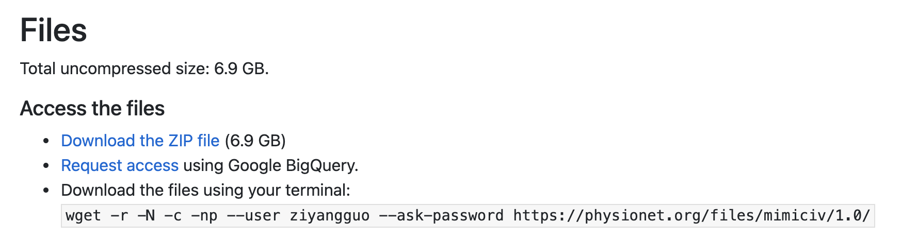

# Backend of TreatmentTree

## Install

   Install from `requirements.txt`
   ```shell
   python -m pip install -r requirements.txt
   ```
We also use a python matlab engine to call matlab functions. This requires installing the MatLab Engine API.
```shell
cd {matlabroot}/extern/engines/python
python setup.py install
```
More information can be found on https://www.mathworks.com/help/matlab/matlab-engine-for-python.html

## Prepare MIMIC-IV Data

Get access to MIMIC-IV from https://physionet.org/content/mimiciv/1.0/. Then select "Request access using Google BigQuery".



Setting up your client credentials if needed. Here is a guide for using client credential to authenticate the API:

https://cloud.google.com/bigquery/docs/authentication/end-user-installed


Put `client_secrets.json` under `AI_Clinician_python_replication/`.

Extract data and preprocess it.

```shell
cd AI_Clinician_python_replication/
python data_extract_MIMICIV.py
cd extracted_data/
python preprocess.py
```

## Train Models

### AI Clinician

```shell
cd AI_Clinician_python_replication/
python main.py
```
*This processing maybe cost several hours...*

### Patient's State Predictor

```shell
cd models/submodels/
python train.py
```
## Start Backend

```
python app.py
```

This will run a backend on port 5000 of your localhost.