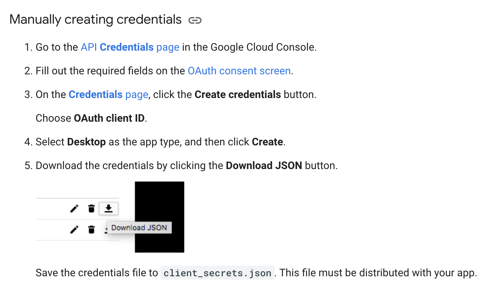

# Backend of TreatmentTree

## Install

   Install from `requirements.txt`
   ```shell
   python -m pip install -r requirements.txt
   ```
We also use a python matlab engine to call matlab functions. This requires installing the MatLab Engine API.
```shell
cd {matlabroot}/extern/engines/python
python setup.py install
```
More information can be found on https://www.mathworks.com/help/matlab/matlab-engine-for-python.html

## Prepare BigQuery Project

In *Google Cloud Platform*, new a project (in my code, it names `rebuilt-mimic-iv`. You can use another name and remember to edit `AI_Clinician_python_replication/data_extract_MIMICIV.py`)

```python
...
...
def main():
    ...
    ...
    if launch_browser:
        appflow.run_local_server()
    else:
        appflow.run_console()
    project = 'rebuilt-mimic-iv' # use your project name here
    ...
    ...

    
if __name__ == '__main__':
    main()
```

## Prepare MIMIC-IV Data

Get access to MIMIC-IV from https://physionet.org/content/mimiciv/1.0/. Then select "Request access using Google BigQuery".


Setting up your client credentials if needed. Here is a guide for using client credential to authenticate the API:

https://cloud.google.com/bigquery/docs/authentication/end-user-installed



Put `client_secrets.json` under `AI_Clinician_python_replication/`.

Requires building **public table** *Elixhauser_Quan* first: https://github.com/MIT-LCP/mimic-code/blob/main/mimic-iii/concepts/comorbidity/elixhauser_quan.sql Note: This one is for MIMIC-III. You can find a MIMIC-IV version in `AI_Clinician_python_replication/data_extract_sql/elixhauser_quan_mimiciv.sql`

Extract data and preprocess it.

```shell
cd AI_Clinician_python_replication/
python data_extract_MIMICIV.py
cd extracted_data/
python preprocess.py
```

## Train Models

### AI Clinician

```shell
cd AI_Clinician_python_replication/
python main.py
```
*This processing maybe cost several hours...*

### Patient's State Predictor

```shell
cd models/submodels/
python train.py
```
## Start Backend

```
python app.py
```

This will run a backend on port 5000 of your localhost.